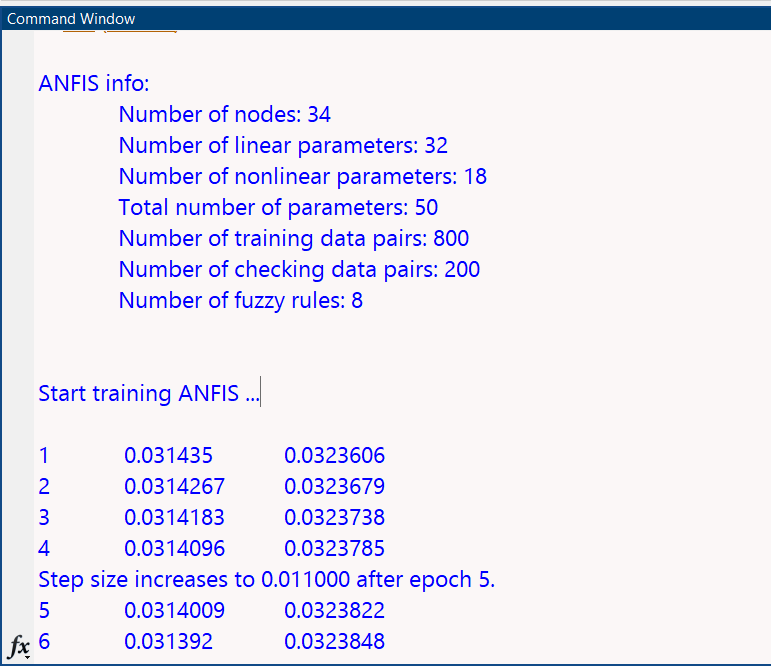

# ANFIS Student Performance Prediction

## Overview
This project implements an Adaptive Neuro-Fuzzy Inference System (ANFIS) to predict student performance based on academic inputs.

## Inputs
- Attendance
- Assignment Marks
- Test Marks

## Output
- Performance Score
- Performance Level (Poor / Average / Good)

## Workflow
Dataset → Preprocessing → ANFIS Training → Testing → Prediction

## Methodology
- Dataset of 1000 students used
- Data normalized
- Train-test split (80-20)
- ANFIS model trained with validation
- Early stopping used to prevent overfitting

## Results
- Training RMSE = 0.0311324  
- Checking RMSE = 0.0323606  
- Best Epoch = 1  
- Final Test RMSE ≈ 3.24  

## Sample Output
Predicted Score = 80  
Performance Level = Good  

## Screenshots

### Training Graph

### Training Process

### Output

## Dataset
[View Dataset](dataset/student_performance_1000.xlsx)
 Details
- 1000 student records
- Features: Attendance, Assignment Marks, Test Marks
- Target: Performance Score

## Report
[View Report](report/Q2_Report.pdf)

## How to Run
1. Open MATLAB
2. Navigate to Q2_ANFIS folder
3. Run Q2.m
4. Ensure dataset path is correct

## Key Highlights
- ANFIS model trained on 1000 student dataset
- Achieved low RMSE (~0.03)
- Early stopping applied
- Good generalization performance

## Tools Used
- MATLAB
- ANFIS

## Author
Sumit Gareri
